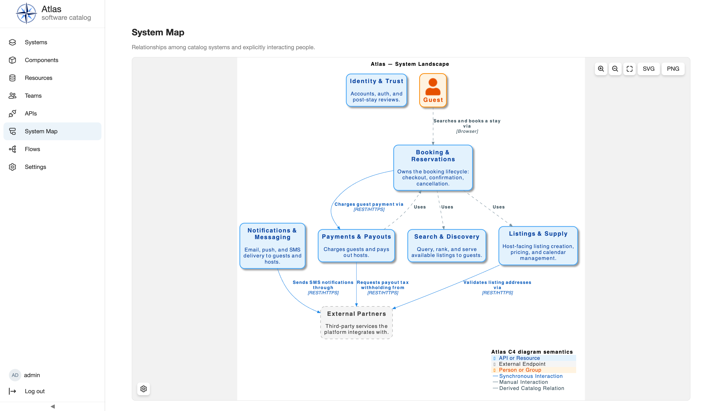

<div align="center">

# Atlas

### An extensible open source software catalog

Atlas puts ownership, dependencies, APIs, diagrams, database schemas, and business
flows in one searchable catalog. Repository manifests keep catalog data close to
the code it describes.

[](LICENSE)
[](https://sidorov-as.github.io/atlas/)

[Documentation](https://sidorov-as.github.io/atlas/) ·
[Getting started](https://sidorov-as.github.io/atlas/getting-started/) ·
[Plugin development](https://sidorov-as.github.io/atlas/plugin-development/)

</div>

<p align="center">
  
</p>

## What is Atlas?

Atlas is a self-hosted catalog for recording software and the relationships around
it. It tracks systems, components, resources, APIs, teams, owners, and lifecycle
state. Plugins add architecture views and other technical details.

Each Atlas installation combines Core with a selected set of plugins. The selection
is explicit and versioned, so the same distribution can be built again.

## Features

- Browse systems, components, resources, APIs, teams, ownership, lifecycle, and
  relationships in one catalog.
- Explore a system landscape and entity-level C4 diagrams.
- Document API specifications, endpoints, operations, SQL schemas, and entity
  relationship diagrams.
- Describe cross-system processes with catalog entities, API operations, external
  participants, and free-form steps.
- Discover repositories and reconcile `catalog-info.yaml` manifests through the
  built-in Git ingestion pipeline.
- Add entity kinds, pages, routes, scheduled work, permissions,
  authentication providers, and integrations through typed plugin contracts.
- Use local credentials, OpenID Connect, or the built-in Gitea OAuth2 adapter
  in the documented deployment topologies, or implement a custom auth
  provider plugin against the authentication provider SDK for another
  identity source, including a self-hosted OAuth2 provider.

## Get started

Atlas requires Docker Desktop with Compose v2. Clone the repository and create the
local environment file:

```shell
cp core/backend/.env.example core/backend/.env
```

Start the development stack:

```shell
docker compose --env-file core/backend/.env -f docker-compose.dev.yml up --build
```

Keep it running. Database migrations run automatically before the backend
starts. Once the stack is up, open <http://localhost:5173>

To explore a populated catalog, load the booking demo:

```shell
docker compose --env-file core/backend/.env -f docker-compose.dev.yml exec backend python manage.py seed_booking_demo --yes
```

## Live demo

A public demo with the booking catalog is available at
<https://atlas-demo-j12z.onrender.com> (free tier: the first open after idle takes
a while, and the data resets nightly).

Sign in as the unprivileged guest user:

- Username: `guest`
- Password: `atlas-demo-guest-password`

`guest` reads the whole catalog and can create and edit entities owned by its
own `guest-team` Group, but cannot change anyone else's.

For a walkthrough of the seeded catalog, including relationships, search, detail,
and diagram views, follow the
[Getting Started guide](https://sidorov-as.github.io/atlas/getting-started/).

## Built-in plugins

The default distribution includes these plugins:

| Plugin           | What it adds                                                                     |
|------------------|----------------------------------------------------------------------------------|
| Standard Catalog | Systems, Components, Resources, Teams, ownership, relations, and lifecycle       |
| APIs             | API specifications, endpoints, operations, and dependency links                  |
| C4               | Catalog-wide and entity-scoped architecture diagrams                             |
| Database Schema  | SQL schema data and ER diagrams attached to Resources                            |
| Ingestion        | Git repository discovery, manifest parsing, claims, and reconciliation           |
| Flows            | Cross-system process documentation linked to catalog entities and API operations |

Atlas selects plugins from a versioned distribution manifest and composes locked
backend and frontend artifacts before startup. The running application does not
download plugins. See [Features and Integrations](https://sidorov-as.github.io/atlas/features/)
and [Distributions](https://sidorov-as.github.io/atlas/configuration/distributions/)
for details.

## Documentation

- [Use Atlas](https://sidorov-as.github.io/atlas/using-atlas/) covers browsing,
  creating, inspecting, and managing catalog entities.
- [Operate Atlas](https://sidorov-as.github.io/atlas/operating-atlas/) covers
  authentication, plugins, migrations, upgrades, and data safety.
- [Concepts and architecture](https://sidorov-as.github.io/atlas/concepts/) explains
  the entity, identity, lifecycle, permissions, and composition models.
- [Build a plugin](https://sidorov-as.github.io/atlas/plugin-development/tutorial/)
  describes the public backend and frontend contracts used to extend Atlas.
- [Reference](https://sidorov-as.github.io/atlas/reference/) lists manifests,
  configuration, registries, management commands, and authentication contracts.
- [Catalog authoring skills](https://sidorov-as.github.io/atlas/features/mcp-skills/)
  (source in [`skills/`](skills/README.md)) let an AI assistant fill the catalog
  from a codebase and build flows through the MCP server.

Runnable examples are available for [authentication](examples/authentication/README.md),
[repository ingestion](examples/ingestion/README.md) and
[search with Meilisearch](examples/search-meilisearch/README.md). For host-only development,
see the [backend](core/backend/README.md) and [frontend](core/frontend/README.md)
guides.

## Contributing

The [contributor guide](https://sidorov-as.github.io/atlas/contributing/) describes
the repository layout, development workflows, architectural constraints, and
validation requirements.

## License

Atlas is available under the [MIT License](LICENSE).
