# Authentication and identity

Atlas keeps authentication, catalog identity, and authorization as separate
layers.

| Concept | Meaning | Lifecycle owner |
| --- | --- | --- |
| Principal | The Django account that authenticates and owns the Atlas session | Authentication Core and operators |
| External Identity | An immutable `(provider_id, source_id, subject)` link to one Principal | Authentication Core and exact operator commands |
| Actor | A Standard Catalog `User` entity used in ownership and relationships | Standard Catalog, ingestion, or Actor provisioning |
| Group or Team | A catalog Group whose effective members can own resources | Operators plus configured reconciliation |
| Membership grant | One reason an Actor belongs to a Group: manual, legacy manual, or provider-owned | Its recorded source |
| Staff or superuser | Django administration state | Operators only |
| Purge Grant | Separately scoped destructive authority | Operators only |
| AccountAccess | Principal-level administrative state, including `read_only` | Operators only |
| Session | A bounded Core-managed browser login | Authentication Core |

A Principal may exist without an Actor and can authenticate, but it cannot
satisfy an owner-Group check. An Actor may exist without a Principal when the
catalog describes someone who never signs in. Automatic Actor provisioning is
an explicit provider policy and does not claim a similar unlinked Actor.

## Provider-independent flow

```mermaid
flowchart LR
    Verify[Selected provider verifies credentials or callback] --> Identity[Normalized source-bound identity]
    Identity --> Link[Core resolves External Identity and Principal]
    Link --> Actor[Core resolves or provisions Actor]
    Actor --> Grants[Core reconciles explicit Group mappings]
    Grants --> Session[Core establishes bounded Django session]
    Session --> Policy[PolicyEvaluator checks ordinary Atlas state]
```

Local, OIDC, Gitea, and custom providers all finish with the same session and
CSRF behavior. Only manifest-selected providers can run. The default controls
the initial login interaction; it does not change identity or authorization
semantics.

An external subject is meaningful only inside its provider and immutable
source. OIDC uses the validated issuer, Gitea uses the canonical instance
origin, and a directory plugin uses an operator-declared namespace. Username,
email, display name, mutable DN, claims, and groups cannot replace that key or
silently join accounts.

## Profile and administrative state

A provider may update only the non-security profile fields delegated by the
manifest. It cannot set active state, staff or superuser flags, Purge Grants,
password or recovery data, identity links, or `AccountAccess.read_only`.
Every linked authentication method shares the Principal's current read-only
state. A live session sees flag changes on the next authorization check.

## Membership grants

An effective Actor-to-Group membership exists while at least one applicable
grant supports the pair. Manual and provider grants remain distinct. Exact
sync can remove or expire only the authenticating identity's grants; another
provider or manual grant continues to authorize the membership. Additive
provider grants remain until explicit removal or source/link revocation.

Group names, OIDC claims, directory attributes, roles, and OAuth scopes do not
grant Atlas permissions directly. They can supply inputs to an explicit Group
mapping. Staff, superuser, and Purge Grant remain operator-managed.

## Sessions and upstream state

Sessions record the establishing provider/source/link, authentication time,
and revocation generations. Core validates them on every request and enforces
a non-sliding absolute lifetime. Atlas logout always invalidates the local
session first. It ends the upstream provider session only when that provider
declares and completes remote logout.

Atlas v1 synchronizes external eligibility and exact groups at login within
finite session and grant bounds. It does not promise immediate upstream
deprovisioning. Operators use local block, link revocation, or revoke-all for
urgent access removal.

For procedures, see [Principal and Actor provisioning](../operating-atlas/identity-provisioning.md),
[Group membership reconciliation](../operating-atlas/group-reconciliation.md),
and [Permissions](permissions.md).
