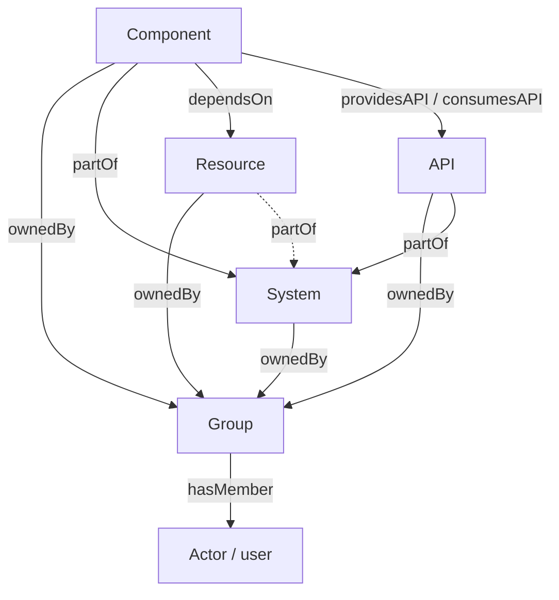

# Entity model

!!! note "Entity model and System shape"
    This page describes the catalog's data model: the Catalog Entity kinds a distribution
    registers and their relationships. For the build and deploy pipeline that assembles and runs
    Atlas, see [System shape](system-shape.md).

Every Catalog Entity has a kind. Its fields determine which other entities it can reference.
Standard Catalog, the plugin every distribution must select, registers five kinds. The optional
APIs plugin registers a sixth:

| Kind (wire value) | Registered by | Declares | Notes |
| --- | --- | --- | --- |
| `system` | Standard Catalog | `architecture.subject.v1` | Groups Components, Resources, and APIs. Owned by exactly one Group. |
| `component` | Standard Catalog | `architecture.subject.v1` | A service, website, library, or worker. Belongs to one System. |
| `resource` | Standard Catalog | `schema.host.v1` | A database, cache, bucket, queue, or cluster. System is optional. |
| `api` | APIs (optional) | None | An OpenAPI, gRPC, AsyncAPI, or GraphQL contract. Belongs to one System. |
| `group` | Standard Catalog | `architecture.actor.v1` | A team, business unit, product area, or the root group. Has Actor members. |
| `user` | Standard Catalog | `architecture.actor.v1` | An Actor is a person, whether or not they can log in. Its Python identifier is `Actor`; its stored/wire kind is `user`. |

Atlas does not have a `Domain` kind that groups Systems as Backstage does. System is the highest
containment level. A capability such as `architecture.subject.v1` lets a plugin like C4 target
"every kind that can appear as a diagram subject" without hard-coding `kind == 'system' or kind == 'component'`.
`resource` does not declare that capability: a Resource can appear *inside* a diagram but is not a
diagram subject.

## Containment and ownership

Two structural relationships shape the taxonomy. Plain fields on each kind's spec drive both of
them. See [Entity references](entity-references.md) for how the resulting Relation rows are
represented and queried.

- **Ownership** (`ownedBy`/`ownerOf`): every System, Component, Resource, and API has exactly one
  `owner`, which must resolve to a `group` ref. A Group is never itself owned, and an Actor has no
  owner concept. `ActorSpecIn` has no `owner` field.
- **Containment** (`partOf`/`hasPart`): every Component and API belongs to exactly one System
  (`system` is required on both); a Resource's `system` is optional. A System does not belong to
  anything above it.

A Component also declares `providesApis`/`consumesApis` edges to `api` entities and a `dependsOn`
edge to `resource` entities. A Group declares a `hasMember` edge to `user` entities. These edges
describe interactions rather than structural containment.

*(Dotted edge: a Resource's `system` is optional; every other edge shown is required.)*

## Entity kinds by authoring path

- **Ingestible kinds:** System, Component, Resource, API, and User can be created manually through
  the UI/API or by an ingestion pipeline that parses `catalog-info.yaml` files. See
  [Life of an entity](life-of-an-entity.md) for how the two paths interact.
- **Admin-managed kinds:** Group is never ingestible. It exists only through Django admin or as
  the `owner` referenced by a manual or ingested entity. User *is* ingestible. Unlike the other
  four ingestible kinds, its spec has no `relationships` field, so it can be a relationship
  *target* but cannot declare a relationship as a *source*.

A kind's fields are visible only through its own `*Details` model, apart from the identity row
shared by every kind. See the `Catalog Entity` and `Entity Kind` entries in the
[domain glossary](glossary.md) for that distinction.
