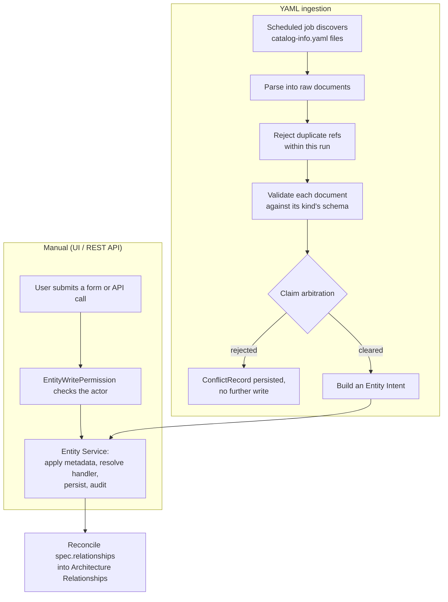

# Life of an entity

Every manual or ingested change to a Catalog Entity goes through the Entity Service. It validates
the common envelope, resolves the Entity Kind Handler, runs a single transaction, and writes an
audit record. For manual writes, it also authorizes the request. The steps before that call
determine who can make the change and whether it is allowed.

## Manual creation, update, and deletion

A manual write is authorized against the acting Principal before anything else happens
(`EntityWritePermission.check_create`/`check_write`; see [Permissions](permissions.md)). Inside
one `transaction.atomic()` block, the Entity Service then:

1. Applies the common envelope (name, title, description, labels, tags, links). Invalid common
   fields never reach the kind handler.
2. Resolves the registered Entity Kind Handler and calls `create_details`/`update_details`,
   which persists only the kind-specific `*Details` row.
3. Writes an `EntityAuditRecord` capturing the actor, the action, and a diff of what changed.

An update sent with `source=manual` against an entity whose `source_kind` is `yaml` is rejected.
A YAML-managed entity accepts writes only from the repository that claims it (see below). Before
deleting an entity, the service runs the kind handler's `validate_delete` in the same transaction.
The delete is blocked with a named list when a System still has Components, Resources, APIs, or
Flows pointing at it; when a Component still references an API through `providesApis` or
`consumesApis`; or when a Resource remains in a Component's `dependsOn`.

## YAML ingestion and claim arbitration

The Ingestion plugin's scheduled job walks each registered repository, discovers
`catalog-info.yaml` manifests, and parses them into raw documents. It completes two passes before
writing any entity:

- **Duplicate detection:** A validation-free peek collects every `(kind, namespace, name)` the
  repository's manifests would produce before any upsert. If two manifests declare the same ref,
  both are rejected.
- **Per-document validation:** Each remaining document is validated against the same Pydantic
  schema used for REST API create requests. A `catalog-info.yaml` document and a `POST` body follow
  the same rules; see the [catalog-info.yaml reference](catalog-info-yaml.md).

Only then does **claim arbitration** decide whether the write is even allowed:

| Existing entity at this ref | Outcome |
| --- | --- |
| None | Claimed: created with `source_kind=yaml`, claimed by this repository (the claim is recorded by Ingestion and exposed as `ingestedFrom`). |
| `source_kind=manual` | Rejected. A `ConflictRecord` (`reason=manual_entity`) is recorded; the manual entity's fields are untouched. |
| `source_kind=yaml`, claimed by *this* repository | Overwritten in full via an `EntityIntent`. Fields the manifest does not mention are reset. |
| `source_kind=yaml`, claimed by a *different* repository | Rejected. A `ConflictRecord` (`reason=other_repository`) is recorded; the existing entity is untouched. |
| `removed`, claimed by a *different* repository or manually | Rejected. A `ConflictRecord` (`reason=removed_entity`) is recorded. A removed entity's ref still reserves the name; see [Removed, Revive, and Purge](#removed-revive-and-purge). |

A rejected claim does not reach the Entity Service. An `EntityIntent` is constructed only after
arbitration clears. Arbitration is re-evaluated on every run, so deleting the manual entity that
blocked a YAML claim allows that claim on the next ingestion pass, with no separate invalidation
step. A `ConflictRecord` remains visible as a banner on the blocked entity that names the rejected
repository, and in Django admin, until a later run resolves the conflict.

An ingestion write calls the Entity Service with `source=yaml` and skips `EntityWritePermission`.
Arbitration has already allowed the write, and ingestion has no actor to authorize.

### Adoption

A manual entity can be handed to a repository through `POST
/api/{kind}/{id}/adopt/`. The endpoint is restricted to a member of the entity's owner Group or a
superuser. It sets `source_kind=yaml`
and the claiming repository without changing any other field. The next ingestion run for that ref
overwrites the entity in full under the same-repository rule above. Once an entity is
YAML-managed, no request can set it back to `manual`.

### Relationship reconciliation

After every document in a repository's manifests has been upserted, a second pass syncs each
entity's declared `spec.relationships` into YAML-origin Architecture Relationships (see
[Entity references](entity-references.md#architecture-relationship)). This happens after all of
the repository's manifests are processed, allowing a declaration to target an entity defined later
in the same or another file. The declared set replaces the entity's prior YAML-origin
relationships. Manually created relationships on that entity are not changed. An unresolved target
is skipped and logged without blocking the entity's other declarations.

## Removed, revive, and purge

System, Component, Resource, and API entities have a `status` of `active` or `removed`. This
soft-decommission state is separate from the cosmetic `deprecated` flag a kind's details may
carry. Removing an entity keeps its row, kind-details row, and existing relations. It hides the
entity from default list and search views, though any authenticated viewer can use the ungated
"show removed" toggle. Its `(kind, namespace, name)` remains reserved, so a competing claim for
that name is rejected.

**Manual entities require an explicit action; YAML entities reconcile automatically.** Their
behavior differs:

- A manually created entity becomes `removed` only when a permitted user or API caller invokes
  Remove. There is no automatic staleness detection because a manual entity has no external source
  of truth to compare. Reviving it also requires an explicit action.
- A manual Remove or Revive request never changes a YAML-managed entity's `status`; both requests
  are rejected, like any other manual write to a `source_kind=yaml` entity. Ingestion
  reconciliation sets it to `removed` when its ref is no longer declared in that repository's
  manifests. A later run sets it to `active` when the same repository re-declares the same ref and
  id. A repository can remove or revive only entities it claims, not entities claimed by another
  repository or manual entities.

**Purge** is the only action that frees a `removed` entity's name. It is available only from
`removed`, even when no other entity has referenced it. Purge requires a **Purge Grant**,
which an owner Group's admins assign per Group or which a global admin holds. The grant also
authorizes Purge on a `source_kind=yaml` entity. Before deleting the entity and its kind-details
row, Purge checks every reference: FK-backed references (`dependsOn`, `providesApis`,
`consumesApis`, `owner`) and ref-string-backed references (a Flow step's
`entity_ref`/`query_ref`/`event_ref`). If any active reference remains, it blocks Purge with a
named list. References that are already `removed` or inactive are cascaded away.

`Removed`/`Revive`/`Purge` apply only at the container level. When a System, Component, Resource,
or API is removed, its children, such as an API's Endpoints and Operations, are treated as removed
for display and reference checking. Their `status` is not changed individually, and there is no
independent per-child removed state.

**Non-goal:** A Resource's `DatabaseSchema` facet remains a single JSON blob and is fully replaced
on every re-parse. Tables and columns have no lifecycle of their own; only the containing Resource
participates in Removed/Revive/Purge.

## Unavailable entities

If a distribution is rebuilt without the plugin that registered an entity's kind, the entity
remains as a read-only **Unavailable Entity**. Reading it returns `spec=None` and
`unavailable=True` rather than calling a handler that no longer exists; writing to it raises
immediately. Its identity, ref, and every Relation and Architecture Relationship pointing at or
from it remain intact. Reinstalling a compatible plugin restores full behavior against the same
underlying rows.

## Repository unregistration is blocked while claimed

A `RegisteredRepository` cannot be deleted while any entity has `source_kind=yaml` pointing at it.
Both `active` and `removed` claimed entities block deletion, and the system provides no
cascade-delete or "orphan and keep" option. To remove the block, apply Remove, or wait for the
next ingestion run to do so, then apply Purge with a Purge Grant to each claimed entity. A
`removed` entity that has not been purged still counts as claimed. Historical `ConflictRecord` rows
do not block deletion. Each records the repository's full name at write time, so a past conflict
remains meaningful after the repository is gone.
