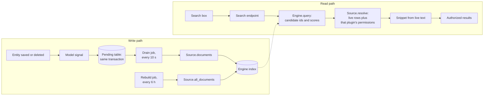

# Search architecture

Atlas search lets a user type a few words and find a catalog entity wherever it
lives. It is optional: a distribution that does not select the search plugins
has no search routes, no search box, no search tables written and no search
jobs. This page explains the three seams that make that possible and which one
to replace for a given change. To turn search on, follow [Enable and operate
search](../operating-atlas/search.md).

## Three seams

| Seam | Owned by | Decides | Replace it to |
| --- | --- | --- | --- |
| **Source** | The plugin that owns the data (the catalog registers one) | What is searchable, how a changed row maps to documents, how to load a hit and who may see it | Make another kind of data searchable |
| **Engine** | A separate engine adapter plugin (`atlas.search-postgres` ships) | Where the index lives and how matches are ranked | Use another index store, such as an external search service |
| **HTTP contract** | The search plugin (`atlas.search`) | The response shape of `GET /api/plugins/atlas.search/search/` | Build another UI or client; or swap the whole search plugin |

The contract types (`SearchDocument`, `SearchSource`, `SearchEngine` and the
registration functions) live in `atlas_plugin_api`, not in the search plugin.
Source and engine plugins therefore never depend on the search plugin, and
registering with no search plugin selected is harmless: nothing reads the
registries.

The search plugin depends on no concrete engine. At startup it takes the engine
that was registered, or the one named by its `engine` setting when several are
selected. See [Choose the engine](../operating-atlas/search.md#choose-the-engine).

## From a data change to a visible result

- **Write path.** A save or delete of a model a source watches records the
  affected document ids in a pending table, in the same database transaction as
  the write. A short-interval job indexes pending ids; a long-interval job
  rebuilds the whole index and repairs anything the signals miss. Details are in
  [Search indexing algorithm](search-indexing.md).
- **Read path.** The engine only returns candidate ids and scores. The search
  plugin groups them by owning source and calls `resolve`, which loads the live
  objects and applies that plugin's own read rules. Results are built only from
  `resolve` output.

## Invariants

- **The index is never trusted for freshness or permissions.** A deleted entity
  or one the caller may not read disappears from results even when the index is
  stale, because `resolve` omits it.
- **Counts come from authorized hits only.** The total is approximate: the
  plugin over-fetches candidates until a page is full, so a page can occasionally
  be short and `total` is a lower bound while `hasMore` is true.
- **Each plugin authorizes its own data.** Atlas has no shared read-permission
  layer, so `resolve` is where a source enforces access.
- **Snippets are made by core by default.** The search plugin builds a safe
  plain-text excerpt around the first match from the resolved text. An engine
  that declares `highlights` capability may supply its own.

## Which seam to replace

| You want to | Replace |
| --- | --- |
| Search your own models (flows, API endpoints and operations and database schemas already have sources) | Add a source: [Write a search source](../plugin-development/search-source.md) |
| Store the index in another system | Add an engine: [Write a search engine](../plugin-development/search-engine.md) |
| Change how the search box looks or behaves | Contribute your own component to the single-occupant search extension point in place of `@atlas/plugin-search` |
| Change indexing or the HTTP API itself | Replace the `atlas.search` plugin, keeping the contract package |

Related reading: [Search index schema](../reference/search-index.md),
[Search feature guide](../features/search.md), [System shape](system-shape.md).
