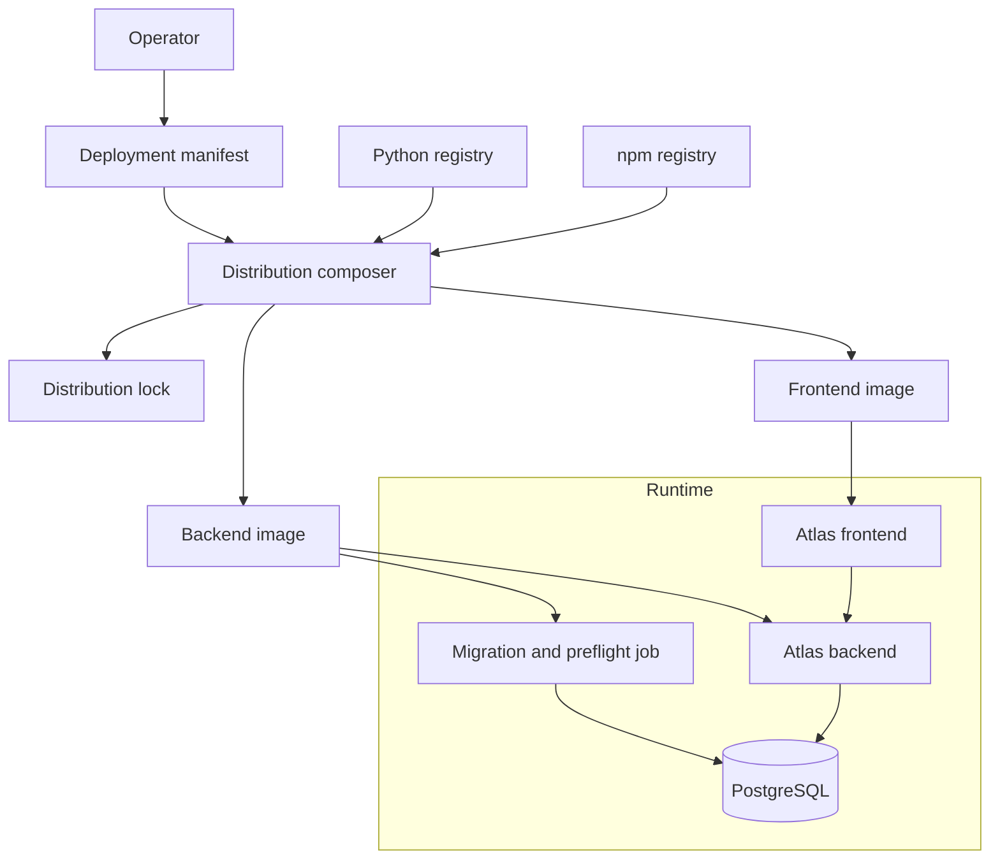

# System shape

An operator lists plugins in a deployment manifest. The composer resolves the manifest against a
package registry and produces a distribution lock, a backend image, and a statically composed
frontend image. At runtime, a migration and preflight job applies schema changes before the
backend and frontend begin using the same PostgreSQL database.

This design has two important properties:

- **Composition happens once before startup.** Containers do not download or resolve packages at
  boot. The lock file pins exact versions and integrity hashes, so the same manifest and lock
  produce the same running system.
- **The frontend is composed statically.** A plugin's frontend contributions are part of the
  built frontend image. The browser does not fetch plugin JavaScript at request time.

## Core and plugin responsibilities

Core owns catalog identity, entity lifecycle, authorization, audit, and the canonical page
structure for every entity. Plugins cannot opt out of or replace these parts. Core without
selected plugins is technically valid, though it does not register a concrete Entity Kind.

Plugins own kind-specific details, Facets, views, ingestion connectors, and protocol adapters.
They communicate with core and with one another through typed extension points and named
capabilities. A plugin does not import another plugin's models or internal modules.

First-party plugins in the same source tree as core use the same extension points and
capabilities as third-party plugins.
