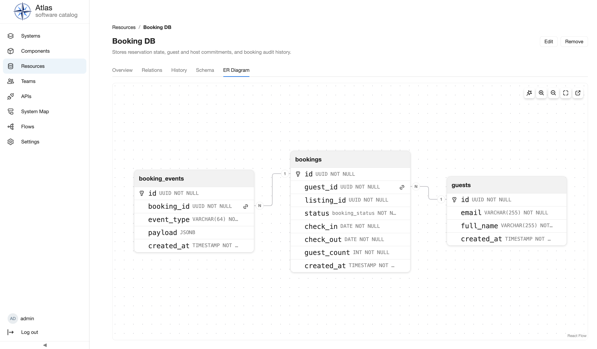

# Database Schema

`atlas.database-schema` adds the `DatabaseSchema` Facet to Resources. It
requires `atlas.standard-catalog` and attaches where the Resource's
`schema.host.v1` capability is present; it owns no separate Entity Kind.

## Enablement, configuration, and permissions

Select the plugin alongside Standard Catalog and run the distribution preflight.
The plugin has no plugin-specific configuration, secrets, or registered
permission. Schema writes reuse the owning Resource's catalog edit authority,
so repository-managed Resources must be changed through their source and
ingestion workflow.

## Repository-managed schemas

When Ingestion is also selected, a `Resource` manifest can declare
`spec.databaseSchema` to keep this Facet in sync with a `.sql` file in the
repository instead of entering it by hand — see [catalog-info.yaml: declaring
a Database Schema
source](../concepts/catalog-info-yaml.md#declaring-a-database-schema-source).

Once a Resource becomes YAML-managed, its Facet can no longer be created or
updated through the Schema tab or this plugin's API — the same read-only rule
every other kind of repository-managed data already follows. This applies
even if the current manifest doesn't declare `spec.databaseSchema`: if a
Resource with a manually-entered Facet is later adopted by ingestion, that
data is not deleted, but it becomes frozen — uneditable by hand — the moment
the Resource becomes YAML-managed, whether or not its manifest ever declares
`spec.databaseSchema`. Declare `spec.databaseSchema` in the manifest to manage
it going forward, or unregister the Resource's repository to restore manual
editing.

## Workflows

Open a Resource, then use the Schema tab to set the dialect and SQL source.
Use the ER Diagram tab to inspect the parsed result. Supported dialects are
PostgreSQL, MySQL, and MS SQL.

Saving parses synchronously: `ok` records structured schema data, while
`failed` preserves a parse-failed state for correction. Verify the result by
reloading the Resource and its ER diagram. For the workflow, see [Use
feature-specific views](../using-atlas/use-feature-views.md).

## API, operations, and extension surface

The facet uses a namespaced Resource-schema API instead of generic entity CRUD.
Consult the running [generated HTTP API reference](../api-reference/index.md)
for its routes. There are no jobs, secret settings, or standalone lifecycle
actions. The facet and its frontend tabs demonstrate capability-targeted
extension; authors should start with [Entity kinds and
facets](../plugin-development/entity-kinds-and-facets.md).

## Limits and troubleshooting

The diagram only reflects successfully parsed supported SQL. Correct dialect
and SQL errors in the Schema editor; a permission failure means the reader
lacks the Resource owner's edit authority. This plugin does not manage a live
database, execute SQL, or infer a schema from a connection.

## Next steps

Read [catalog editing](../using-atlas/create-edit-entities.md), [Operating
Atlas](../operating-atlas/index.md), [permissions](../concepts/permissions.md),
the [Plugin API reference](../plugin-development/reference.md), and the
[generated HTTP API reference](../api-reference/index.md).
