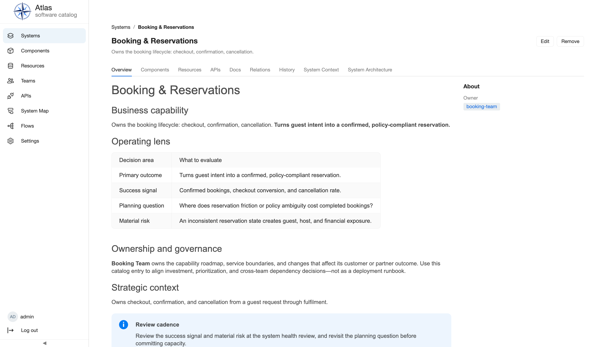
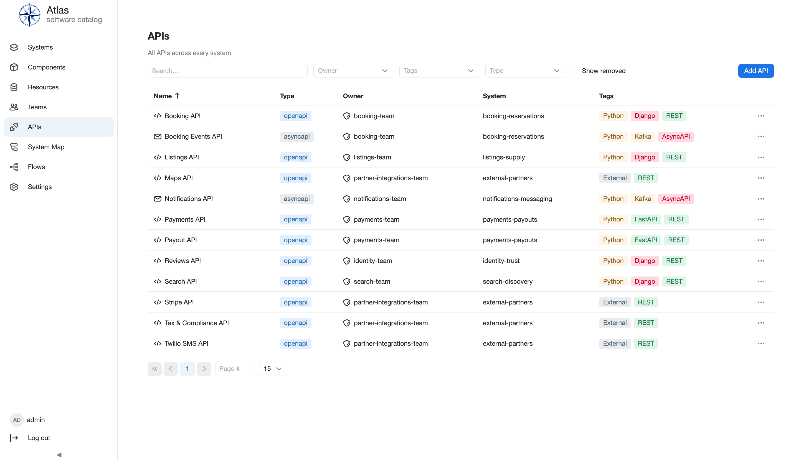
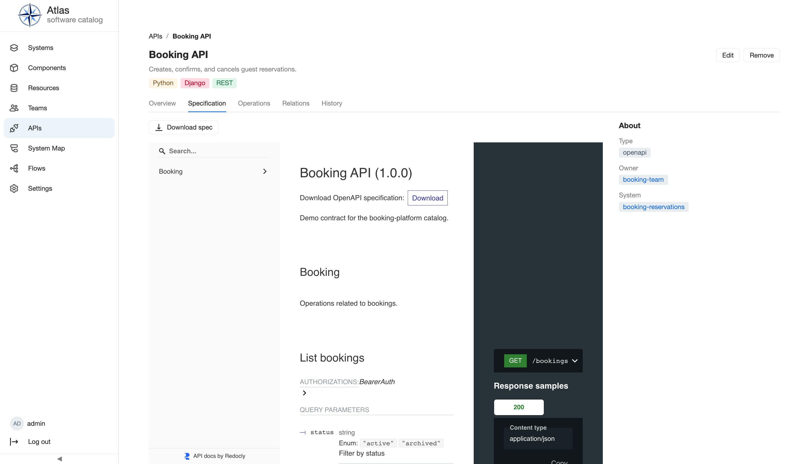
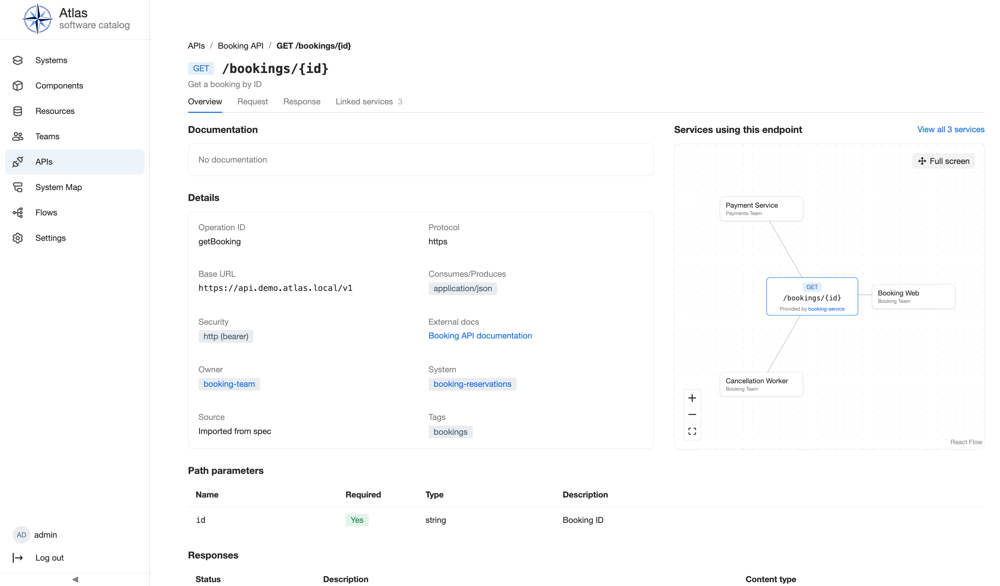
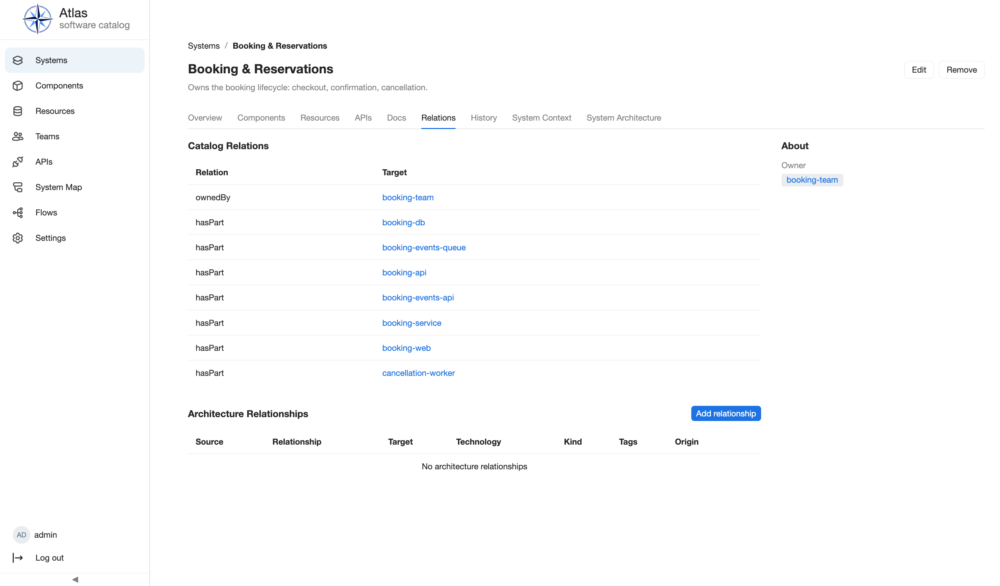
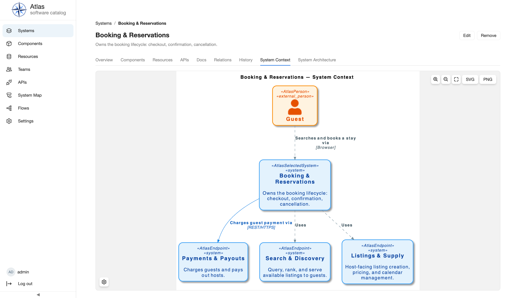
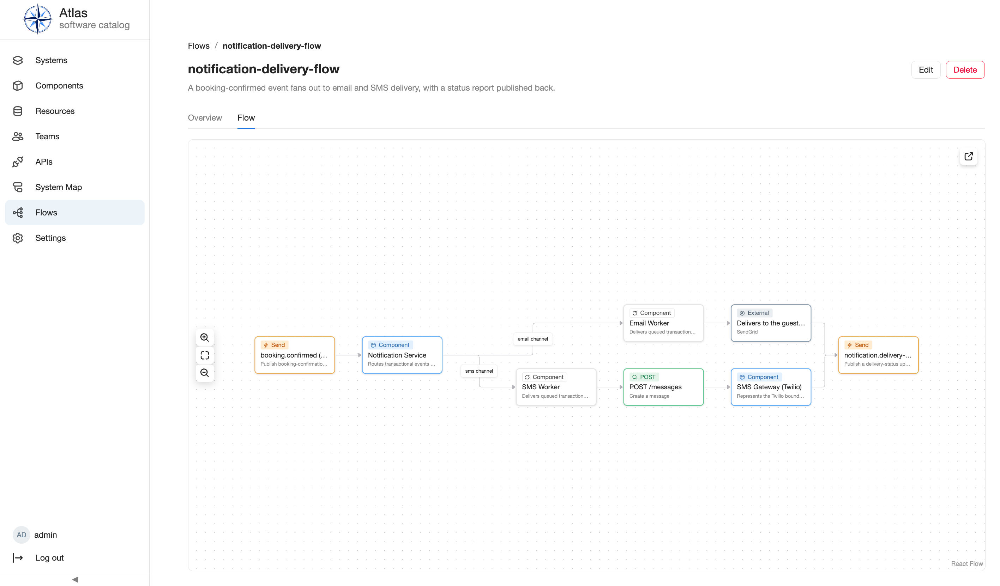

# Tour the demo catalog

This tour follows the reproducible booking demo from the catalog home page to
specific catalog facts. Browse the demo without changing it, open a System in
more detail, and compare derived catalog relations with declared architecture
relationships before viewing a System Context diagram. From there, the tour
continues outward to an API specification and one of its operations, a
cross-system Flow, a Resource's database schema, and the catalog-wide System
Map.

<!--
Capture verification for this page:
- source commit: 969de2e64412a44d3daeca113b5b2298a72511db
- data: core booking demo after `seed_booking_demo --yes`; no post-seed data mutation
- browser: 1440x900 CSS-pixel viewport, DPR 1, 100% zoom, Atlas light theme
- list: default name-ascending sort; no search, owner/tag filters, or removed entities
- diagram: System Context loaded, settings closed, Fit to viewport selected, then
  Zoom out selected once so the complete graph remains visible below the page chrome
- apis list: default unfiltered list, no search/owner/tag/type filters or removed entities
- apis spec: Booking API Specification tab loaded, embedded spec viewer finished rendering
- apis operation: GET /bookings/{id} Overview tab, linked-services graph finished loading
- flow: notification-delivery-flow Flow tab, graph finished loading, Fit to viewport
- schema: Booking DB ER Diagram tab, graph finished loading, Fit to viewport
- system map: System Map loaded, settings closed, Fit to viewport selected
- recapture triggers and review checklist: docs-site/authoring/page-contracts.md
-->

## Before you begin

Complete [Run Atlas locally](development.md), including the booking demo seed,
and sign in at <http://localhost:5173>. The screenshots below use the seeded
local administrator, but these read-only browsing steps require only an
authenticated Atlas session.

If the seeded account [cannot sign
in](../deployment/troubleshooting.md#the-seeded-administrator-cannot-sign-in),
or the [named demo Systems do not
appear](../deployment/troubleshooting.md#the-seeded-catalog-is-missing-or-does-not-render),
resolve that symptom before continuing the tour.

The tour follows a visible path from the catalog home page to the relationships
around **Booking & Reservations**, then outward to an API, a Flow, a
Resource's schema, and the catalog-wide System Map.

## 1. Start on the catalog home page

The home page summarizes the catalog with linked totals for **Systems**,
**Components**, **APIs**, **Resources**, and **Teams**. Use these cards to open
the corresponding searchable lists and see how much of the catalog is already
populated.

Below the totals, **About this catalog** explains what Atlas tracks and the two
ways to add entities: register them manually in the catalog UI or ingest them
from a repository's `catalog-info.yaml`. Superusers can customize this content
from **Settings → Home**.

Select **Systems** in the navigation or use the **Systems** total on the home
page to continue with the searchable catalog records.

## 2. Scan the Systems list

The default Systems list is unfiltered, excludes removed entities, and is
sorted by name. Each row combines the human-readable title with its description,
owner, and tags.

Find **Search & Discovery** near the end of the list. The filter bar is the
place to narrow larger catalogs; this baseline capture deliberately has no
search text, owner filter, tag filter, or **Show removed** selection.

## 3. Preview without leaving the list

Select the **Search & Discovery** row once. Atlas keeps the list in place and
opens a preview panel with the owner and description. The open-details control
in the panel header moves to the canonical entity page; the close control
returns to the full-width list.

Use the preview to identify the System quickly. The full detail page includes
tabs, lifecycle actions, history, and feature-specific views.

## 4. Open the System detail

Return to the list, select **Booking & Reservations**, and open its detail page.
The **Overview** tab includes the seeded description and owner alongside
maintained documentation for the System's business outcome, success signal,
planning question, and material risk.

Use the tabs to move between the same entity's Components, Resources, APIs,
documentation, relations, history, and C4 views. The owner in the **About** rail
links to the responsible Team.

## 5. Browse the API catalog

Select **APIs** in the navigation. Like the Systems list, this page is
unfiltered by default and lists every API across every System with its type,
owner, System, and tags.

Find **Booking API**, owned by `booking-team` under **Booking & Reservations**,
and select it to open its detail page.

## 6. Read an API's specification

The API detail page has its own tabs: **Overview**, **Specification**,
**Operations**, **Relations**, and **History**. Select **Specification** to
render the imported OpenAPI contract in place, with a spec download and a
per-operation reference panel.

Ingestion imports Endpoints from an OpenAPI specification and Operations from
an AsyncAPI specification; this demo API is OpenAPI-sourced. See
[APIs](../features/apis.md) for how specifications are supplied and refreshed.

## 7. Inspect an operation and its linked services

Select **Operations**, then open **GET /bookings/{id}**. Its **Overview** tab
lists operation details — operation ID, protocol, security, owner, and System —
beside a graph of the services that use this exact endpoint.

This graph is more specific than a System-level relation: it names the
individual services linked to this Operation rather than the API as a whole.

## 8. Separate catalog and architecture relationships

Select **Relations**. **Catalog Relations** come from structured catalog facts:
the System is owned by `booking-team` and contains the displayed Resources,
APIs, and Components. **Architecture Relationships** record explicit runtime
interactions.

In this seeded System view, the architecture table is empty because the demo
declares runtime interactions from lower-level entities, not from the System
record. Separate sections keep derived ownership and containment facts from
looking like manually declared runtime calls. See [entity
references](../concepts/entity-references.md) for how linked targets retain a
stable catalog identity.

## 9. Read the System Context diagram

Select **System Context**, wait for rendering to finish, close diagram settings
if they are open, and use **Fit to viewport**. The capture uses one additional
**Zoom out** step so the complete graph remains visible below the page chrome at
the baseline viewport.

Read each arrow from source to target. Labels describe the interaction and, when
present, its technology. The diagram stays at System level. The adjacent
**System Architecture** tab shows the selected System's lower-level elements.

## 10. Follow a Flow triggered by the booking lifecycle

Select **Flows** in the navigation and open **notification-delivery-flow**,
then its **Flow** tab. A Flow documents an ordered process across catalog
entities and API operations; this one starts where the tour's own booking
domain hands off to notifications.

Read the graph left to right: a `booking.confirmed` event reaches the
Notification Service Component, which routes it over labelled channels to the
Email Worker and SMS Worker, each delivering to an external provider, before a
delivery-status event is published back. See [Flows](../features/flows.md) for
the available step types and how to create one.

## 11. Inspect a Resource's database schema

Select **Resources**, open **Booking DB** — the Resource backing Booking &
Reservations — and select its **ER Diagram** tab.

The diagram is parsed from the Resource's declared SQL schema: `bookings`
links to `guests` and to `booking_events` through foreign keys, with
cardinalities marked on each connector. See [Database
Schema](../features/database-schema.md) for supported dialects and how a
repository-managed schema differs from a manually entered one.

## 12. View the catalog-wide System Map

Select **System Map** in the navigation. Unlike the entity-scoped System
Context from step 9, this diagram renders every System in the catalog at
once.

Booking & Reservations sits at the center of the same interactions seen in its
System Context, now alongside every other System and the shared **External
Partners** boundary. See [C4](../features/c4.md) for layout controls and SVG/PNG
export.

## Verify the tour

After the tour, you should be able to:

- identify **Booking & Reservations** in both the Systems list and the
  catalog-wide System Map;
- open and close a list preview without losing the current list state;
- reach the System's owner and maintained documentation from **Overview**;
- explain why **Catalog Relations** and **Architecture Relationships** are
  separate;
- identify the Guest and three neighboring Systems in **System Context**;
- find an API's Specification and an Operation's linked-services graph;
- read a Flow's step-by-step diagram across Components and external
  participants; and
- read a Resource's ER Diagram back to its declared tables and keys.

Continue with [Using Atlas](../using-atlas/index.md) for the task-oriented
catalog workflows, or return to [Getting Started](index.md) to choose another
reader journey.
