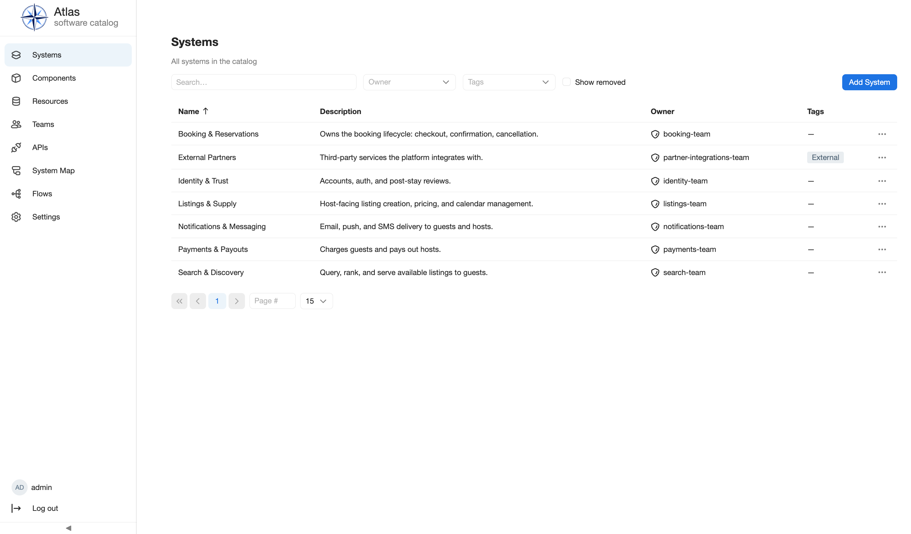
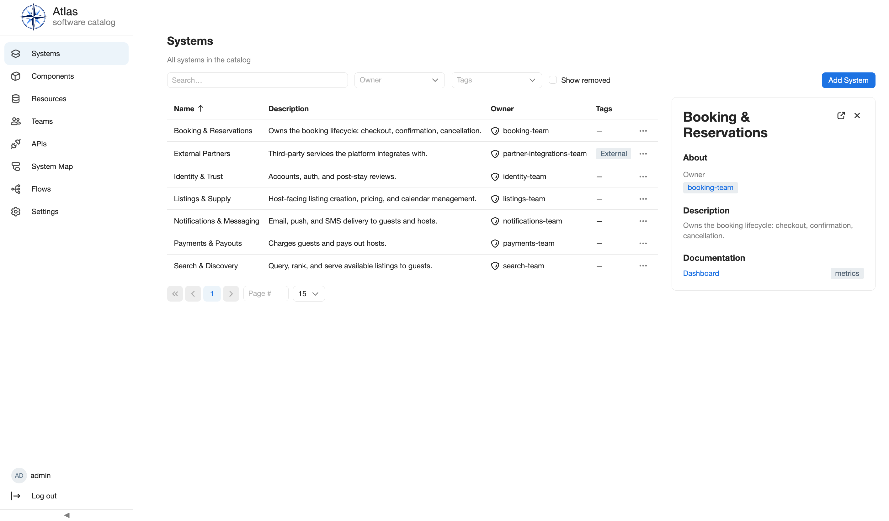

# Browse the catalog

Use the catalog lists when you know the kind of software record you need but do
not know its exact entity reference. This guide takes you from the Atlas navigation
to a filtered result, a quick preview, and the entity's full detail page.

## Outcome

You will find one active entity, verify its summary without leaving the list,
and open its canonical detail page. You will also know where Atlas exposes
ownership-based views and which personal views are not currently available.

## Prerequisites

- You are signed in to a running Atlas distribution. The checked-in default
  distribution and the [Getting Started tutorial](../getting-started/development.md)
  provide every navigation item used below.
- The distribution selects Standard Catalog for **Systems**, **Components**,
  **Resources**, and **Teams**. It selects the APIs plugin for **APIs**.
- For the reproducible examples, load the checked-in demo data as described in
  [Getting Started](../getting-started/development.md#3-load-the-booking-demo).

## Permissions

An authenticated session can browse these catalog lists and detail pages with
the built-in policy evaluator. Ownership and edit permissions are not required
for read-only browsing. The **Add**, **Edit**, and lifecycle actions visible
near these views are separate workflows; see [Permissions](../concepts/permissions.md)
before changing an entity.

## 1. Choose the entity kind

Use the left navigation to open the list that matches the record you need:

| Navigation item | Use it to find | List-specific columns |
| --- | --- | --- |
| **Systems** | Product or domain boundaries | Description, owner, tags |
| **Components** | Services, websites, libraries, and workers | Type, lifecycle, owner, system, tags |
| **Resources** | Databases, caches, buckets, queues, and clusters | Type, owner, optional system, tags |
| **Teams** | Groups, their members, and the entities they own | Type and member count |
| **APIs** | OpenAPI, gRPC, AsyncAPI, and GraphQL records | Type, owner, system, tags |

The active navigation item remains highlighted on both its list and detail
routes. Selecting the Atlas logo returns to the catalog home page.

## 2. Search by catalog text

On **Systems**, **Components**, **Resources**, or **APIs**, enter text in
**Search**. Atlas performs a case-insensitive substring search across the
entity's machine name, description, and documentation content. For example,
`search` finds the demo System whose machine name is `search-discovery` and
whose displayed title is **Search & Discovery**.

Search does not have a submit step. Changing or clearing the field reloads the
first result page. A displayed title is not a separate search field, so use the
machine name or text from the description or documentation if a title-only
query returns no result.

The **Teams** list currently has no search field. Sort it by **Name** or move
through its pages, then use the preview to confirm the team.

## 3. Narrow the list with filters

Filters combine with the search text. Clearing a filter returns to the first
page.

| List | Available filters |
| --- | --- |
| **Systems** | Owner, Tags, Show removed |
| **Components** | Owner, Tags, Type (`service`, `website`, `library`, `worker`), Lifecycle (`experimental`, `production`, `deprecated`), Show removed |
| **Resources** | Owner, Tags, Type (`database`, `cache`, `bucket`, `queue`, `cluster`), Show removed |
| **APIs** | Owner, Tags, Type (`openapi`, `grpc`, `asyncapi`, `graphql`), Show removed |
| **Teams** | No list filters in the current UI |

Select more than one tag when any of those tags is acceptable; tag matching is
an overlap test, not an "all selected tags" requirement. **Show removed** adds
removed records to the active records and reveals a **Status** column. It is
not a removed-only view. The unchecked default lists active records only.

## 4. Sort and page through results

Select the **Name** column heading to switch between ascending and descending
server-side name order. Lists start in ascending name order. Changing search,
a filter, tag selection, status visibility, or sorting returns you to page 1.

The pager starts with 15 rows per page. Use its page controls or page-number
input to move through the result set, and choose 15, 30, 50, or 100 rows per
page. Search, filters, sorting, page, and the open preview are local to the
current list screen; Atlas does not currently encode this state in the URL for
sharing or bookmarking.

## 5. Inspect a preview

Select a row once. Atlas keeps the list visible and opens a panel on the right.
The panel always shows the display title and description, plus these summary
fields:

| Kind | Preview fields |
| --- | --- |
| System | Owner |
| Component | Type, lifecycle, owner, system |
| Resource | Type, owner, optional system |
| API | Type, owner, system |
| Team | Type, member count |

Owner and system values in the panel link to their catalog detail pages. Use
**Close preview** in the panel header to restore the full-width list.

## 6. Open the full detail page

In the preview header, select **Open full details**. Atlas opens the canonical
route for that entity and shows a breadcrumb back to its list. The first
available tab is selected initially; additional tabs depend on the entity kind
and the plugins selected in the distribution.

Use the preview for quick identification. Use the detail page for
documentation, relationships, history, lifecycle status, feature-specific
tabs, or available actions. The next catalog guide covers those details.

## 7. Browse by ownership

Atlas currently supports two ownership paths:

1. On the Systems, Components, Resources, or APIs list, select an **Owner** to
   restrict that kind to one team.
2. Open **Teams**, select a team, and open its full details. The **Systems**,
   **Components**, **Resources**, and **APIs** tabs list the records owned by
   that team. Each ownership tab can be filtered by tags and paged, and its
   rows open the corresponding entity details.

There is currently no personal **Favorites**, **My entities**, or bookmarked
catalog view. Use the owner filter or Team detail tabs for the supported
ownership-oriented workflow.

## Verify the result

With the demo catalog loaded:

1. Open **Systems** and search for `search`.
2. Confirm that **Search & Discovery** appears.
3. Select the row and confirm that the preview shows owner `search-team`.
4. Select **Open full details** and confirm that the breadcrumb links back to
   **Systems**.
5. Open **Teams**, open **Search Team**, and confirm that **Search & Discovery**
   appears on its **Systems** ownership tab.

## Common problems

### A navigation item is missing

Navigation items are contributed by selected plugins. Confirm that the running
distribution includes Standard Catalog for Systems, Components, Resources, and
Teams, and the APIs plugin for APIs. Operators can review [distribution
assembly](../configuration/distributions.md); catalog users should contact the
distribution operator.

### A known entity is missing from the list

Clear Search and every filter, return to page 1, and check **Show removed**. If
the visible title did not match, search by the machine name or a term from its
description or documentation. A still-missing record may not have been created
or ingested; continue with the relevant catalog-maintenance workflow.

### The list says that no entities match

The active search and filters produced an empty intersection. Clear them one
at a time. Multiple selected tags match any selected tag, but tag filtering
still combines with the owner, type, lifecycle, status, and search constraints.

### The preview disappeared after changing the result set

The preview only renders while its selected entity is on the current result
page. Clear the new filter or return to the page containing the entity, then
select its row again.

## Next steps

- Read [Entity model](../concepts/entity-model.md) to understand what each kind
  represents.
- Read [Entity references](../concepts/entity-references.md) for owner, system,
  and relationship links.
- Read [Life of an entity](../concepts/life-of-an-entity.md) before using
  **Show removed** as part of a lifecycle task.
- Use [feature-specific catalog views](use-feature-views.md) after opening an
  entity that leads to an API, C4 diagram, database schema, or Flow workflow.
- Continue to the [Standard Catalog feature guide](../features/standard-catalog.md)
  for the installed feature boundary.
